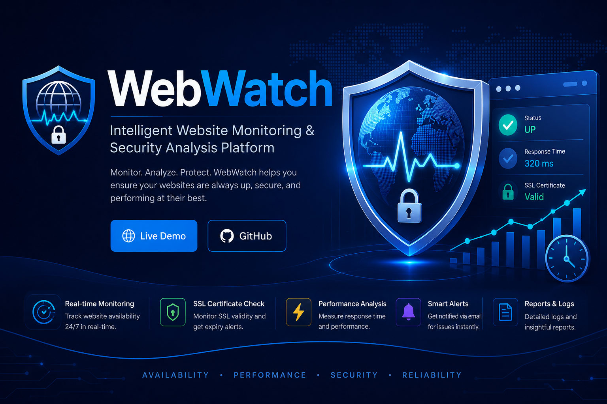
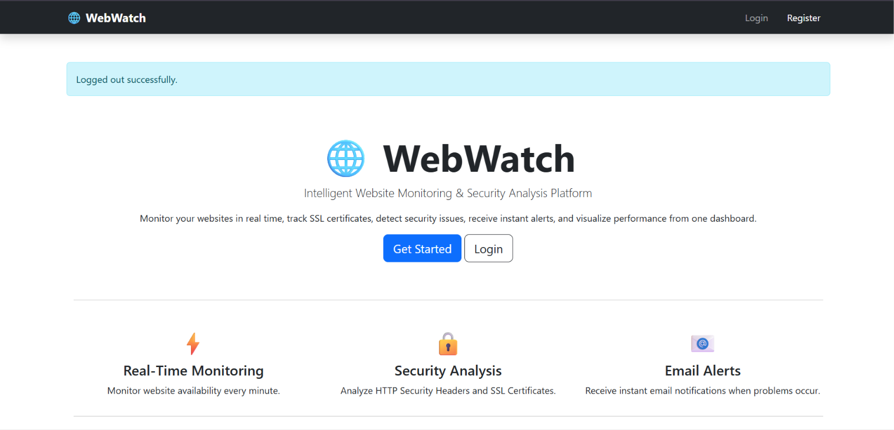
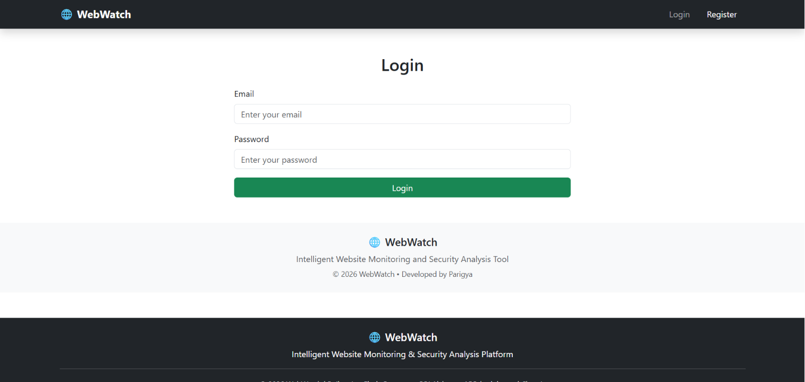
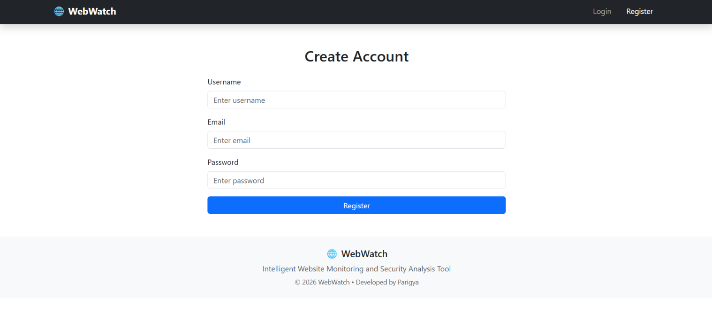
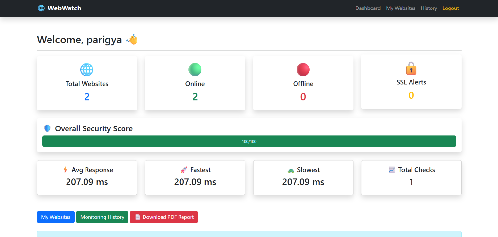
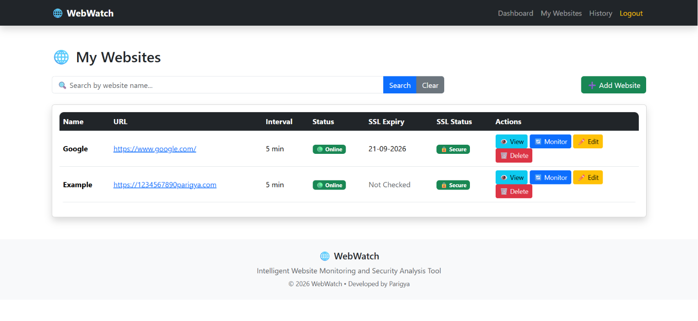
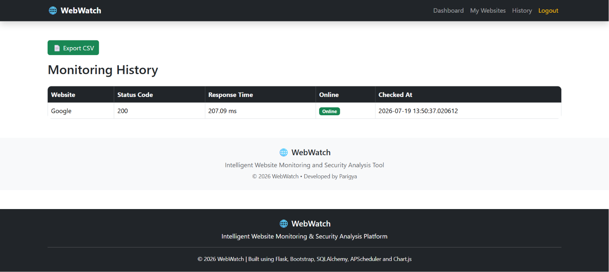
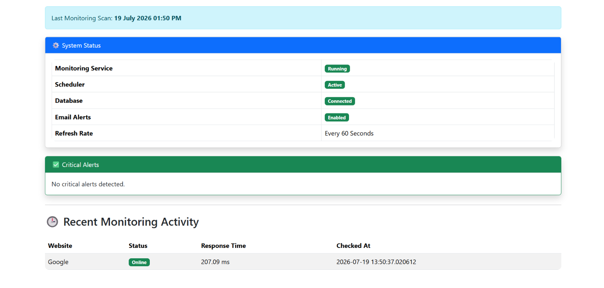

<p align="center">
  
</p>

<h1 align="center">🛡️ WebWatch</h1>

<p align="center">
  <strong>Intelligent Website Monitoring & Security Analysis Platform</strong>
</p>

<p align="center">
Monitor • Analyze • Protect
</p>

<p align="center">


</p>

<p align="center">

🌐 **Live Demo:** https://webwatch-9ky3.onrender.com

⭐ If you like this project, consider starring the repository.

</p>

---

# 📖 About WebWatch

WebWatch is a modern web-based monitoring platform that enables users to continuously monitor website availability, performance, SSL certificate validity, and HTTP security headers from a centralized dashboard.

The application automatically performs scheduled health checks, stores monitoring history, and generates detailed PDF reports, helping website owners proactively identify downtime and security issues.

---

# ✨ Key Features

- 🌍 Website Availability Monitoring
- ⚡ Response Time Measurement
- 🔒 SSL Certificate Expiry Detection
- 🛡 HTTP Security Header Analysis
- 📈 Interactive Dashboard
- 📄 PDF Report Generation
- 👤 User Authentication
- 📊 Monitoring History
- ⏰ Automatic Monitoring Scheduler
- ☁ Cloud Deployment on Render

---

# 🚀 Live Application

**Production URL**

https://webwatch-9ky3.onrender.com

---

# 🛠 Technology Stack

| Category | Technology |
|-----------|------------|
| Backend | Flask |
| Language | Python 3.14 |
| Database | PostgreSQL (Neon) |
| ORM | SQLAlchemy |
| Authentication | Flask Sessions |
| Scheduler | APScheduler |
| Charts | Plotly |
| Reports | ReportLab |
| Deployment | Render |
| Version Control | Git & GitHub |

---

# 📷 Screenshots

## Home Page



---

## Login



---

## Register



---

## Dashboard



---

## Add Website



---

## Website Monitoring



---

## Security Header Analysis



---

## PDF Report


---

# 🏗 Project Architecture

Architecture diagram

> *(Architecture diagram will be added in `/docs/architecture.png`.)*

---

# 🗄 Database Design

Entities

- Users
- Websites
- Monitoring Logs
- Notifications

> *(ER Diagram will be added in `/docs/database_schema.png`.)*

---

# 📂 Project Structure

```text
WebWatch
│
├── app.py
├── wsgi.py
├── config.py
├── requirements.txt
├── README.md
│
├── database/
│
├── monitoring/
│
├── reports/
│
├── templates/
│
├── static/
│
├── screenshots/
│
└── docs/
```

---

# ⚙ Installation

## Clone Repository

```bash
git clone https://github.com/Parigya2325/WebWatch.git
```

```bash
cd WebWatch
```

---

## Create Virtual Environment

Windows

```bash
python -m venv .venv
```

Activate

```bash
.venv\Scripts\activate
```

---

## Install Dependencies

```bash
pip install -r requirements.txt
```

---

## Configure Environment

Create your database connection in `config.py`.

---

## Run Application

```bash
python app.py
```

Application will start at

```
http://127.0.0.1:5000
```

---

# ☁ Deployment

This application is deployed on **Render** using

- Gunicorn
- PostgreSQL (Neon)
- Python 3.14

Production URL

https://webwatch-9ky3.onrender.com

---

# 🔄 Project Workflow

1. User registers and logs in.
2. User adds a website.
3. Website details are stored in PostgreSQL.
4. APScheduler checks websites automatically.
5. SSL certificates are validated.
6. Security headers are analyzed.
7. Results are saved in Monitoring Logs.
8. Dashboard displays monitoring statistics.
9. Users can export PDF reports.

---

# 🎯 Future Enhancements

- SMS Alerts
- WhatsApp Notifications
- Docker Support
- Kubernetes Deployment
- Multi-user Roles
- AI-based Downtime Prediction
- Website Performance Analytics
- Mobile Application
- REST API
- Email Verification

---

# 👨‍💻 Contributors

| Name |
|------|
| **Parigya** |
| **Shreya** |
| **Prakriti** |

---

# 📜 License

This project is licensed under the MIT License.

---

# ⭐ Support

If you found this project helpful, consider giving it a ⭐ on GitHub.

It motivates us to continue building useful open-source projects.